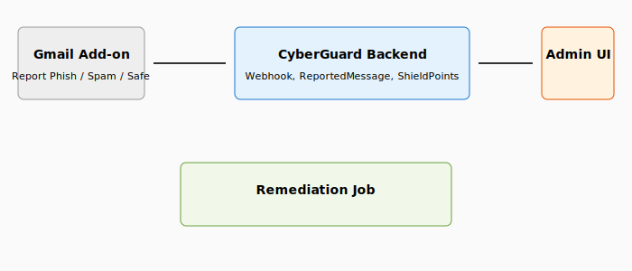

# CyberGuard – Internal Phishing Awareness Platform

[](https://opensource.org/licenses/MIT)
[](https://laravel.com)
[](https://php.net)
[](https://workspace.google.com/)

Production-ready internal phishing awareness platform for **authorized security awareness testing on your own Google Workspace domain only**.

---

## Screenshots & architecture

| Architecture | Demo |
|--------------|------|
| [](docs/architecture.svg) | [](docs/logo.png) |

High-level flow: **Gmail Add-on** (Report Phish / Spam / Safe) → **CyberGuard Backend** (webhook, ReportedMessage, ShieldPoints, audit) → **Admin UI** (reports, remediation). Remediation runs as a job (ProcessRemediationJob, MailboxActionLog). See [docs/ARCHITECTURE.md](docs/ARCHITECTURE.md) for details.

---

## Overview

To get CyberGuard running:

1. **Install** – Clone the repo, run `composer install`, copy `.env.example` to `.env`, and generate an app key.
2. **Configure** – Edit `.env` with your database credentials and (for the Gmail add-on) a webhook secret. See [Step-by-step installation](#step-by-step-installation) below.
3. **Database** – Create an empty MySQL database, run `php artisan migrate`, then either:
   - **Production:** Run the interactive installer: `php artisan cyberguard:install` (creates your first tenant and super admin; **use a strong password**).
   - **Local dev:** Run `php artisan db:seed` for roles and landing page; optionally `php artisan db:seed --class=DevSeeder` for a demo tenant and users (example.com).
4. **Run** – Start the app with `php artisan serve` and open http://localhost:8000. Log in with the account you created (production) or a seeded demo account (local; see [First login](#5-first-login-local-dev-only)).

For the Gmail Report Phish add-on, follow [Gmail Report Phish add-on setup](#gmail-report-phish-add-on-setup) after the app is running.

**Quick reference – production (after DB and .env):**

```bash
composer install && cp .env.example .env && php artisan key:generate
php artisan migrate
php artisan cyberguard:install   # Interactive: tenant name, domain, allowed domains, slug, super admin name/email/password
php artisan serve
```

**Quick reference – local dev (demo tenant + users):**

```bash
composer install && cp .env.example .env && php artisan key:generate
php artisan migrate && php artisan db:seed && php artisan db:seed --class=DevSeeder
php artisan serve
```

Then open http://localhost:8000 and log in (production: the account you created in the installer; local: **admin@example.com** / **password** — dev only).

> **Passwords must be complex.** When running `cyberguard:install`, choose a strong super admin password: at least 8 characters, and use a mix of uppercase, lowercase, numbers, and symbols. Do not use default or guessable passwords in production.

---

## What you need

| Requirement | Notes |
|-------------|--------|
| **PHP ^8.2** | Must match `composer.json`. Extensions: mbstring, xml, pdo_mysql, json, openssl, tokenizer |
| **Composer** | [getcomposer.org](https://getcomposer.org) |
| **MySQL 8+** | Or MariaDB 10.3+ |
| **Redis** (optional) | For production queues/cache; for local you can use `CACHE_STORE=file` and `QUEUE_CONNECTION=sync` |

---

## Step-by-step installation

Follow these steps in order. All commands are run from the project root (the folder that contains `artisan`).

### 1. Clone the repo and install dependencies

```bash
git clone <your-repo-url> CyberGuard
cd CyberGuard
composer install
cp .env.example .env
php artisan key:generate
```

- Replace `<your-repo-url>` with your actual Git repository URL (e.g. `https://github.com/yourorg/CyberGuard.git`).
- You should see: **Application key set successfully.**

### 2. Configure environment

Open the `.env` file in a text editor. Set at least the following.

**Database (required)**  
Set these to match your MySQL server. The database must exist before you run migrations.

```env
DB_CONNECTION=mysql
DB_HOST=127.0.0.1
DB_PORT=3306
DB_DATABASE=cyberguard
DB_USERNAME=root
DB_PASSWORD=your_mysql_password
```

Create the database in MySQL (run this in MySQL or your DB tool):

```sql
CREATE DATABASE cyberguard CHARACTER SET utf8mb4 COLLATE utf8mb4_unicode_ci;
```

**Webhook secret (required for the Gmail add-on)**  
Generate a long random string and put it in `.env`. You will use the **same value** in the Gmail Apps Script project (Script properties).

```env
PHISHING_WEBHOOK_SECRET=your-secret-at-least-32-characters-long
```

To generate a secret:

```bash
php -r "echo bin2hex(random_bytes(24));"
```

**Local development (no Redis)**  
If you are not using Redis, set:

```env
CACHE_STORE=file
QUEUE_CONNECTION=sync
```

**Leave as-is for safe local testing (no real emails sent):**

```env
PHISHING_SIMULATION_ENABLED=false
PHISHING_ALLOWED_DOMAINS=example.com
```

### 3. Run migrations and create your first tenant/admin

From the project root, run migrations first:

```bash
php artisan migrate
```

**Production (recommended):** Do **not** seed default tenants or users. Use the interactive installer to create your first tenant and super admin with your own values:

```bash
php artisan cyberguard:install
```

You will be prompted for:

- **Tenant name** – e.g. your organization name  
- **Tenant domain** – e.g. `company.com` (used for tenant identification and add-on)  
- **Allowed domains** – comma-separated domains that may receive simulation emails (defaults to tenant domain)  
- **Tenant slug** – leave empty to auto-generate from the name, or enter one (e.g. `acme`)  
- **Super admin name** – full name of the first admin  
- **Super admin email** – login email  
- **Super admin password** – **use a strong password** (min 8 characters; use uppercase, lowercase, numbers, and symbols)

The installer creates the tenant and a platform superadmin (no default credentials). It also seeds the default landing page, phishing attacks, and badges for that tenant. You can log in immediately after. If a tenant or superadmin already exists, the installer will skip unless you pass `--force` (not recommended in production).

**Local development only:** To get a demo tenant and users (example.com, admin@example.com, etc.) for testing:

```bash
php artisan db:seed
php artisan db:seed --class=DevSeeder
```

`db:seed` creates roles and the default landing page. `DevSeeder` creates the example.com tenant and demo users; it **only runs when `APP_ENV=local`**. In production, `db:seed` is blocked unless you set `SEEDER_ALLOW_PRODUCTION=true` (see [Security](#security-production-checklist)).

### 4. Start the application

From the project root:

```bash
php artisan serve
```

Open a browser to **http://localhost:8000**. You should see the login page.

### 5. First login

- **Production:** Log in with the **super admin email and password** you set when you ran `php artisan cyberguard:install`. Use the **Tenant** dropdown in the sidebar to select your tenant.
- **Local dev (after DevSeeder):** Use **one** of these demo accounts to log in. **Do not use these in production.**

| Email | Password | Role | What you can do |
|-------|----------|------|-----------------|
| platform_admin@example.com | password | Superadmin | Access **all tenants**; use tenant switcher in the sidebar to switch between them |
| admin@example.com | password | Superadmin | Access **default tenant only** (example.com) |
| viewer@example.com | password | Viewer | View-only access to the default tenant |

- **Tenant switcher**: After login, the left sidebar shows a **Tenant** dropdown. Use it to switch context. Platform superadmins see all tenants; others see only their tenant.
- **Adding your own admins**: Create users with the appropriate `tenant_id` and role (e.g. analyst, campaign_admin). See your deployment docs or the app’s user management for how to create users.

### 6. (Optional) Run queue workers and scheduler

These are **only needed** when you actually send phishing simulations or run remediation. Run them from the **project root** in a separate terminal (or as a background process / systemd service in production).

**When sending phishing simulations** (after you set `PHISHING_SIMULATION_ENABLED=true`):

```bash
php artisan queue:work --queue=phishing-send
```

**When running remediation** (trashing confirmed phishing from mailboxes):

```bash
php artisan queue:work --queue=remediation
```

**Run both queues with one worker:**

```bash
php artisan queue:work --queue=phishing-send,remediation
```

**Campaign send window (spread emails over a date range):**  
If you create a campaign with a **send window** (from/to date) and **emails per recipient** &gt; 1, messages are created as *scheduled* and sent over time. You must run either:

- The Laravel scheduler (recommended): add to your crontab:  
  `* * * * * cd /path/to/your/project && php artisan schedule:run`  
  (Laravel will run `phishing:send-scheduled` every 5 minutes), or  
- The command directly on a schedule (e.g. every 5 minutes):  
  `php artisan phishing:send-scheduled`

---

## Gmail Report Phish add-on setup

The **Google Workspace add-on** is included in this repo (`google-addon/` folder). Once deployed, it appears **inside Gmail** when users open an email: they see **"CyberGuard Report Phish"** with options to **Report Phish**, **Report Spam**, or **Mark Safe**. Clicking Report Phish sends the message details to your CyberGuard backend so analysts can review it. You can use a shield icon for the add-on by setting `logoUrl` in `google-addon/appsscript.json` (see [Logo and branding](#logo-and-branding)).

**Set up the add-on after** the Laravel app is running and you have set `PHISHING_WEBHOOK_SECRET` in `.env`.

1. **Create an Apps Script project**
   - Go to [script.google.com](https://script.google.com).
   - Click **New project**.
   - In the project, open the default `Code.gs` and `appsscript.json`. Replace their contents with the contents of **`google-addon/Code.gs`** and **`google-addon/appsscript.json`** from the CyberGuard repo (copy and paste, then save).

2. **Set Script properties**
   - In Apps Script: **Project settings** (gear icon) → **Script properties** (or File → Project properties → Script properties).
   - Add two properties (click **Add script property** for each):

   | Property name | Value |
   |---------------|--------|
   | **WEBHOOK_URL** | Your CyberGuard report API URL. Production: `https://your-domain.com/api/webhook/report`. Local testing (with ngrok): `https://your-ngrok-url.ngrok.io/api/webhook/report` |
   | **WEBHOOK_SECRET** | The **exact same** value as `PHISHING_WEBHOOK_SECRET` in your Laravel `.env` file |

   If the secret does not match, the webhook will reject reports with 401.

3. **Deploy the add-on**
   - Click **Deploy** → **New deployment**.
   - Select type **Add-on** (or **Test deployment** / **Internal** depending on your Workspace).
   - Restrict the add-on to your Google Workspace domain so only your users see it in Gmail. For step-by-step deployment (test vs internal/domain-wide), see **`google-addon/README.md`** in the repo.

4. **Multi-tenant (optional)**  
   If you have multiple tenants (e.g. different domains), the add-on can send which tenant the report belongs to. In the webhook request from the add-on, include the header:  
   **`X-Tenant-Domain: yourdomain.com`**  
   The value must match a tenant’s **domain** in the CyberGuard database (Settings / tenant configuration).

---

## Google Workspace deployment (production)

- **Laravel:** Deploy to your server (PHP, MySQL, Redis recommended). In `.env` set `APP_URL` and `PHISHING_WEBHOOK_SECRET`. The add-on calls **POST** `/api/webhook/report`; the server verifies the request using the header `X-Phish-Signature: sha256=<hmac_sha256(raw_body, PHISHING_WEBHOOK_SECRET)>`.

- **Gmail removal (remediation):** To allow analysts to trash confirmed phishing from user mailboxes:
  1. In `.env` set:  
     `PHISHING_GMAIL_REMOVAL_ENABLED=true`  
     `GOOGLE_APPLICATION_CREDENTIALS=/path/to/service-account.json`  
     `GOOGLE_WORKSPACE_DOMAIN=yourdomain.com`  
     `GOOGLE_ADMIN_USER=admin@yourdomain.com`  
  2. In Google Admin Console, give the service account **domain-wide delegation** with these scopes:  
     - Gmail API (read/send/modify as needed for trash).  
     - Admin SDK Directory API: `https://www.googleapis.com/auth/admin.directory.user.readonly` (for listing users).  
  3. In CyberGuard **Settings**, configure each **tenant** with its domain, path to the service account JSON (or use the global `.env` credentials), and remediation policy.

- **Campaign group targets (send to a Google Group):** So that choosing “Group” in a campaign pulls each member and sends one email per person, the service account also needs this scope in domain-wide delegation:  
  **`https://www.googleapis.com/auth/admin.directory.group.member.readonly`**  
  Add it in Admin Console alongside the other Directory scopes. Ensure each tenant that uses group targets has **Google credentials** (and admin user) set in Settings.

---

## Features (overview)

- **Multi-tenant**: Separate tenants (e.g. staff vs student) with their own domain, credentials, webhook secret, and remediation policy. Tenant switcher in the admin sidebar.
- **Simulation campaigns**: Templates, target users/groups/CSV, approval workflow. Optional **attack library**: multiple phishing message variants (e.g. “account deactivation”, “Duo notification”) with difficulty ratings; attach several to a campaign to mix content per recipient.
- **Gmail add-on**: Report Phish (with optional “I clicked the link” / “I entered information”), Report Spam, Mark Safe. Webhook matches reports to simulations and awards Shield points.
- **Remediation**: When a report is confirmed as real phishing, approve a remediation job (optional **dry run** to simulate without trashing), then run to trash the message across domain mailboxes. Counts for removed, skipped, dry-run (simulated), and failed; full logging per mailbox action.
- **Shield points & leaderboard**: Points ledger and monthly leaderboard per tenant.
- **Admin UI**: Dark-themed dashboard (metrics, recent reports, campaigns, remediation job, top reporters, audit log), Reports, Remediation, Campaigns, Attack library, Leaderboard, Audit Logs, Settings. RBAC: superadmin, campaign_admin, analyst, viewer.

Details: [docs/ARCHITECTURE.md](docs/ARCHITECTURE.md).

---

## API

The only public API endpoint is the report webhook below. The `/api` routes also include a Sanctum-protected group reserved for future internal admin tools; it is currently a placeholder with no routes.

### Webhook (for add-on)

**POST** `/api/webhook/report`

- **Headers:** `Content-Type: application/json`, `X-Phish-Signature: sha256=<hmac_sha256(raw_body, PHISHING_WEBHOOK_SECRET)>`
- **Optional:** `X-Tenant-Domain: yourdomain.com` for multi-tenant

**Example body:**

```json
{
  "report_type": "phish",
  "reporter_email": "user@yourdomain.com",
  "gmail_message_id": "18c2a1b2e3d4f5g6",
  "gmail_thread_id": "...",
  "subject": "Urgent: Verify your account",
  "from": "IT Support <support@example.com>",
  "from_address": "support@example.com",
  "to_addresses": "user@yourdomain.com",
  "date": "Mon, 7 Mar 2025 12:00:00 +0000",
  "snippet": "Please click here to verify...",
  "headers": {},
  "user_actions": ["clicked_link"]
}
```

**Responses:** `200` OK with `{ "ok": true, "reported_message_id": 1, "correlation_id": "uuid" }`; `401` invalid signature; `422` validation error; `503` add-on disabled.

---

## Config reference

These are set in **`.env`** (or in tenant **Settings** in the app where noted).

| Variable | Description | Example |
|----------|-------------|--------|
| PHISHING_SIMULATION_ENABLED | When `false`, no simulation emails are sent. Set `true` only when you are ready to send. | `false` (dev) |
| GMAIL_REPORT_ADDON_ENABLED | When `false`, the report webhook returns 503 (add-on disabled). | `true` |
| PHISHING_ALLOWED_DOMAINS | Comma-separated list of domains that may receive simulation emails. | `example.com` |
| PHISHING_WEBHOOK_SECRET | Must **exactly match** the WEBHOOK_SECRET in your Gmail Apps Script project. | Long random string |
| PHISHING_GMAIL_REMOVAL_ENABLED | When `true`, remediation can trash messages from mailboxes (requires Google credentials). | `false` (dev) |
| PHISHING_OPEN_TRACKING | Track link opens in simulations. | `true` |

---

## Tests

```bash
composer test
# or
php artisan test
```

Feature tests cover: auth and dashboard access, webhook (signature, unknown tenant, valid payload with tenant), tracking, **tenant isolation** (scoped user cannot see other tenant’s reports; middleware overrides tampered session; platform admin can use any tenant), **remediation** (report_only tenant cannot approve; dry-run approval and completion status; run requires approved job; dry-run vs real removal counters and final status), **points awarding** (simulation_reported and reported_phish ledger; leaderboard sum), and **role enforcement** (viewer cannot confirm phish or approve remediation; analyst can).

---

## Logo and branding

- **Admin app:** Place your logo at `public/images/cyberguard-logo.png`.
- **Gmail add-on (shield icon):** In `google-addon/appsscript.json`, set **`logoUrl`** to a publicly accessible URL of your shield or report-phish icon (e.g. `https://your-domain.com/images/report-phish-shield.png`). Users will see this icon next to "CyberGuard Report Phish" in Gmail.

---

## Security (production checklist)

- **First-run setup:** Use `php artisan cyberguard:install` to create your first tenant and super admin. Do not rely on seeded default tenants or users in production.
- **Passwords:** Super admin and all user passwords must be **complex**: at least 8 characters, with a mix of uppercase, lowercase, numbers, and symbols. The installer enforces a minimum length; choose a strong password and do not reuse it elsewhere.
- **Seeding:** In production, `php artisan db:seed` is **blocked** unless you set `SEEDER_ALLOW_PRODUCTION=true` in `.env`. Use that only if you need to add roles/landing pages; do not use it to create default tenants or users. `DevSeeder` (demo tenant/users) only runs when `APP_ENV=local`.
- **Debug:** Never run with `APP_DEBUG=true` in production. Set `APP_DEBUG=false` and set `APP_URL` to your real URL (used for redirects and links).
- **Webhook secret:** Keep `PHISHING_WEBHOOK_SECRET` long and random. The webhook rejects requests with an invalid signature. Rotate the secret if compromised and update it in both `.env` and the Gmail Apps Script project.
- **Add-on and admin access:** Deploy the Gmail add-on only to your Google Workspace domain. Use HTTPS for the app and restrict admin routes to trusted networks or VPN where possible.
- **Credentials:** Do not commit `.env`. Store the Google service account JSON outside the web root and reference it by path.
- **Tenant isolation:** Each tenant has its own data scope; do not reuse the same webhook secret across tenants.
- **Landing pages:** Training/landing HTML from the database is sanitized. Only allow trusted admins to create or edit landing pages.
- **Redirects:** Tracking redirects are limited to the host in `APP_URL`; set `APP_URL` correctly in production.

---

## License

MIT.
